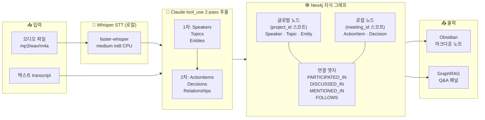
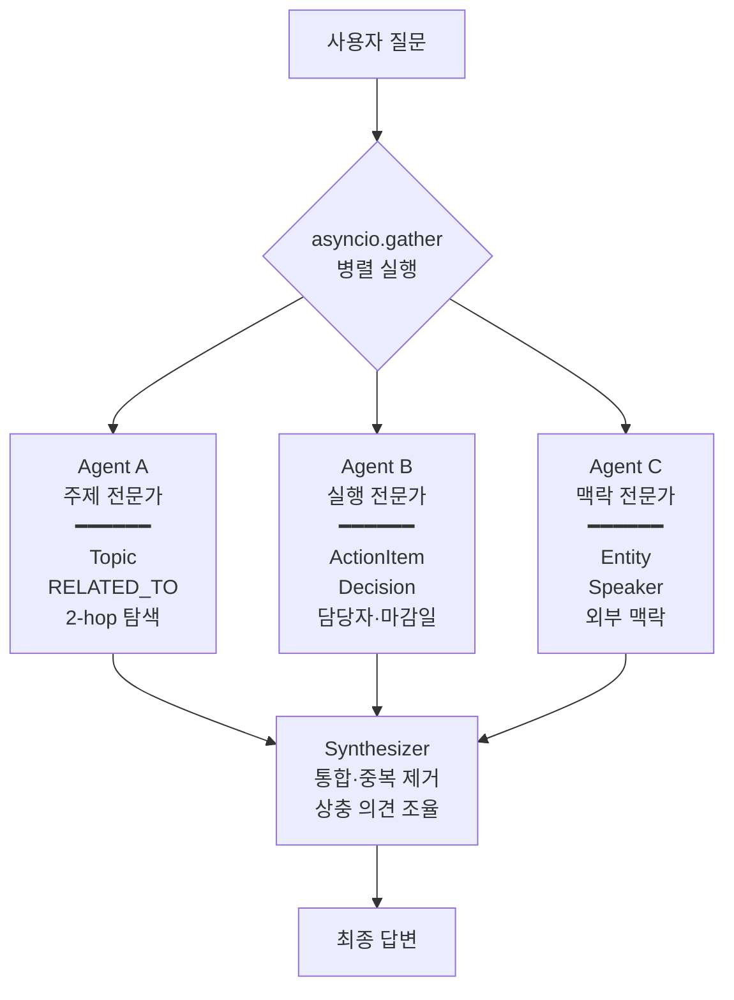

# Meeting Summarizer + GraphRAG Expert Panel

[](https://www.python.org/)
[](https://fastapi.tiangolo.com/)
[](https://neo4j.com/cloud/aura/)
[](https://www.anthropic.com/)
[](https://github.com/guillaumekln/faster-whisper)
[](LICENSE)

> 회의 오디오/텍스트를 **Neo4j 지식 그래프**로 구조화하고, **멀티 에이전트 GraphRAG**로 질의응답하며, **Obsidian 노트**까지 자동 생성하는 회의 분석 시스템입니다. 클로바노트·Notta 같은 범용 SaaS가 "회의 하나를 예쁘게 저장"하는 데 집중한다면, 이 프로젝트는 **여러 회의가 누적되는 프로젝트의 '지식자산'** 을 만드는 데 집중합니다.

---

## 🎯 이 프로젝트가 해결하는 문제

대부분의 회의록 도구는 **회의 하나를 독립적으로** 요약합니다. 하지만 실제 프로젝트는 수 주~수 개월에 걸쳐 **여러 번의 회의**로 진행되고, 팀은 아래 같은 질문에 답해야 합니다:

- "4주차에 번복된 결정이 있었는데, 1~3주차 중 어느 회의에서 원래 결정된 거였지?"
- "이 주제가 프로젝트 내내 어떻게 진화했지?"
- "Andrew가 1주차부터 4주차까지 어떤 입장 변화를 보였지?"
- "지금까지 pending인 액션 아이템 중 3회차 이상 이월된 건?"

범용 SaaS는 이런 **교차 회의 질의**에 답할 수 없습니다. 회의를 텍스트 요약으로만 저장하기 때문입니다. 이 프로젝트는 **Neo4j 지식 그래프 + 멀티 에이전트 GraphRAG** 조합으로 이 gap을 해결합니다.

---

## 🏗️ 아키텍처



### GraphRAG 에이전트 구조



3개 에이전트가 각자의 관점으로 그래프를 탐색한 뒤 Synthesizer가 통합합니다. 단일 LLM보다 관점 누락이 적고, `asyncio.gather` 덕분에 지연은 1x지만 비용은 3x (필요 시 Haiku로 일부 교체 가능).

---

## 📊 AMI ES2002 4회차 검증 결과

`edinburghcstr/ami` 데이터셋의 **ES2002a/b/c/d (리모컨 디자인 4회차)** 로 실제 검증한 결과입니다. 상세 수치는 [REPORT.md](REPORT.md) 10장 참조.

### 텍스트 경로

| 항목 | 결과 |
|---|---|
| Speaker 4회차 전부 병합 | ✅ **4/4명** (Laura, Andrew, David, Craig) |
| 2회 이상 공유 Topic | ✅ **10개** (리모컨 기능, 재무 전략, DSMB, 음성 인식 등) |
| 2회 이상 공유 Entity | ✅ **14개** (Remote Control, LCD Display, Kinetic Power 등) |
| FOLLOWS 체인 | ✅ w2→w1 → w3→w2 → w4→w3 |
| 전체 그래프 | 4 Meeting · 4 Speaker · 14 Topic · 18 Entity · 14 ActionItem · 36 Decision |

**연속성을 확인하는 3가지 질문**을 `project_id` 모드로 던졌고, 전부 교차 회차 인과 추적을 포함한 답변을 얻었습니다:

1. **"설계 요구사항이 어떻게 진화했나?"** → "시장 판단(a-b) → 사용성(c) → 예산(d)"의 깔때기 구조 정확히 추적. "16.8€ → 12.5€ 예산 조정이 LCD·키네틱 전원·고무 소재 제거를 연쇄 강제"까지 파악.
2. **"어떤 결정이 번복됐나?"** → 전원 방식(배터리→키네틱→배터리), LCD 2단계 제거, 음성인식 조건부 유보 등 **5가지 번복 사례** 식별.
3. **"팀원들은 어디서 충돌했나?"** → Andrew(혁신)/David(현실)/Laura(조율)/Craig(기술) 역할 분화를 대화 맥락에서 재구성.

### 오디오 경로 (ES2002a 1회차)

| 지표 | 값 |
|---|---|
| **WER** | **30.45%** (Deletion 535 지배적, 원인: Mix-Headset 단일 채널 vs ihm 4채널) |
| 핵심 숫자 보존 | ✅ **€25 / €12.50** 완벽 |
| 참가자 이름 | ⚠️ Laura/Andrew/David ✅, **Craig → Greg 오인식** |

**핵심 관찰**: WER 30%에도 구조화된 숫자·결정은 완벽 보존되지만, **STT 오류(Craig→Greg)가 Speaker 노드로 그대로 전파**됩니다. 이 관찰이 다음 개선 단계(임베딩 기반 정규화)의 근거가 됐습니다.

---

## 🆚 Notta / Clova Note / Otter와의 비교

| 기능 | Clova Note | Notta | Otter | **이 프로젝트** |
|---|---|---|---|---|
| STT 품질 (한국어) | 🟢 최고 | 🟡 보통 | 🔴 약함 | 🟡 Whisper 기반 |
| STT 품질 (영어) | 🟡 보통 | 🟢 좋음 | 🟢 좋음 | 🟢 Whisper-medium |
| 화자 분리 (diarization) | 🟢 지원 | 🟢 지원 | 🟢 지원 | 🔴 미지원 (Claude 맥락 추정) |
| 실시간 녹음 | 🟢 | 🟢 | 🟢 | 🔴 파일 업로드 only |
| 타임스탬프 클릭 재생 | 🟢 | 🟢 | 🟢 | 🔴 |
| **여러 회의 누적 그래프** | 🔴 | 🔴 | 🔴 | 🟢 **project_id 스코프** |
| **교차 회의 질의응답** | 🔴 | 🔴 | 🔴 | 🟢 **GraphRAG 3-agent panel** |
| **도메인 커스터마이징** | 🔴 고정 | 🔴 고정 | 🔴 고정 | 🟢 **tool schema·프롬프트 수정** |
| **자체 호스팅** | 🔴 | 🔴 | 🔴 | 🟢 **Neo4j self-hosted + 로컬 STT** |
| **관계 기반 추론** | 🔴 | 🔴 | 🔴 | 🟢 **그래프 2-hop 탐색** |
| 모바일 앱 | 🟢 | 🟢 | 🟢 | 🔴 |
| 가격 | 🟢 개인 무료 | 🟡 유료 | 🟡 유료 | 🟢 오픈소스 (API 비용만) |

**포지셔닝**: 범용 회의록 도구와 정면 대결하지 않습니다. **"개별 회의의 품질"이 아닌 "여러 회의가 누적되면서 생기는 프로젝트 수준의 맥락"** 을 다루는 다른 카테고리의 도구입니다.

### 이런 팀에 적합합니다

**1. 여러 회의가 누적되는 프로젝트의 "지식자산"을 쌓고 싶은 팀**
임상시험·제품 개발·장기 연구처럼 "4주차의 결정이 1주차 논의를 번복한 건지", "특정 주제가 프로젝트 전체에서 어떻게 진화했는지"를 추적해야 하는 팀.

**2. 민감한 회의를 외부 클라우드로 보낼 수 없는 팀**
법률 자문·의료 회의·R&D 미팅·투자 심사 등 외부 SaaS 업로드가 곤란한 경우. Whisper는 로컬, Neo4j는 self-hosted 가능, Obsidian vault는 파일시스템. Claude API만 외부 호출이며 이것도 로컬 LLM(Qwen/Llama)으로 교체 가능한 구조.

**3. 특정 도메인에 맞춰 커스터마이징이 필요한 팀**
범용 SaaS의 고정 스키마로는 도메인 특화 지식을 반영하기 어렵습니다. 이 프로젝트는 [api/extractor.py](api/extractor.py)의 tool schema, 시스템 프롬프트, [api/agents.py](api/agents.py)의 에이전트 역할 분담, [graph/cypher_queries.py](graph/cypher_queries.py)의 노드 라벨까지 모두 코드 수준에서 수정 가능.

---

## ⚠️ 알려진 한계 (Known Limitations)

포트폴리오용 프로젝트이며, 아래 한계를 명시적으로 인지하고 있습니다:

1. **한국어 STT 품질은 Clova Note에 못 미칩니다.** Whisper medium은 한국어 특화 엔진이 아닙니다. 한국어 시연이 목적이면 STT를 네이버 CLOVA Speech API로 교체하는 게 현실적입니다.

2. **화자 분리(diarization)가 없습니다.** 현재는 Mix-Headset WAV 하나로 STT를 돌리고 Claude가 맥락으로만 화자를 추정합니다. ES2002a 실험에서 Craig을 Greg으로 오인식한 사례가 이 한계의 직접 증거입니다. **pyannote.audio 통합이 가장 유효한 개선 방향**입니다.

3. **Topic·Entity 이름 정규화가 LLM 프롬프트에 의존합니다.** 지금은 "이전 회차 이름 목록"을 시스템 프롬프트에 주입해서 Claude가 같은 이름을 재사용하도록 유도합니다. AMI 텍스트 경로에선 잘 작동했지만, STT 오류가 있는 오디오 경로에선 깨집니다. 임베딩 기반 fuzzy matching이 다음 개선 단계입니다.

4. **실시간 녹음·모바일·타임스탬프 링크 없음.** 범용 SaaS가 당연히 제공하는 UX 기능은 이 프로젝트 범위 밖입니다.

5. **Claude API 의존.** Anthropic API 비용이 발생합니다. `/process-text` 한 번에 2회 호출, `/agents` 한 번에 4회 호출(에이전트 3 + Synthesizer). 로컬 LLM으로 교체 가능한 구조이지만 현재 구현은 Claude Sonnet 4.6 기준.

---

## 🚀 실행 방법

### 1. 의존성 설치

```bash
pip install -r requirements.txt
```

### 2. 환경변수 설정 (`.env`)

`.env.example`을 복사해서 `.env`로 만들고 채웁니다:

```bash
cp .env.example .env
```

```env
ANTHROPIC_API_KEY=sk-ant-...
NEO4J_URI=neo4j+s://xxxxxxxx.databases.neo4j.io
NEO4J_USERNAME=xxxxxxxx
NEO4J_PASSWORD=...
NEO4J_DATABASE=xxxxxxxx
WHISPER_MODEL=./models/whisper-medium  # 또는 "medium" (자동 다운로드)
WHISPER_COMPUTE_TYPE=int8
WHISPER_LANGUAGE=en                    # 또는 ko
OBSIDIAN_VAULT_PATH=./MeetingNotes
```

### 3. FastAPI 백엔드

```bash
python -m uvicorn api.main:app --port 8000
```

Swagger UI: http://localhost:8000/docs

### 4. Streamlit 프론트엔드

```bash
python -m streamlit run frontend/app.py --server.port 8502
```

### 5. 빠른 테스트

Swagger UI에서 `/process-text` 엔드포인트에 아래 JSON으로 POST:

```json
{
  "meeting_id": "test-001",
  "transcript": "(tests/sample_transcript.txt 내용)",
  "title": "Q2 임상시험 계획 검토",
  "date": "2026-03-21",
  "project_id": "clinical_trial_2026_q2"
}
```

---

## 🔌 주요 API 엔드포인트

| Method | Path | 설명 |
|---|---|---|
| POST | `/stt` | 오디오 → STT + 전체 파이프라인 (BackgroundTask) |
| GET | `/stt/status/{job_id}` | STT 진행 상태 |
| POST | `/process-text` | 텍스트 직접 처리 (추출→그래프→노트 E2E) |
| POST | `/extract` | Claude tool_use 추출만 |
| POST | `/graph/build` | Neo4j 그래프 구축만 |
| POST | `/obsidian/write` | Obsidian 노트 생성만 |
| POST | `/agents` | GraphRAG 패널 Q&A (meeting_id 또는 project_id 스코프) |
| GET | `/graph/{meeting_id}` | 그래프 통계 |
| GET | `/meetings` | 전체 회의 목록 |
| GET | `/health` | 헬스체크 |

---

## 📂 프로젝트 구조

```
03_meeting_summarizer/
├── api/                          백엔드
│   ├── main.py                   FastAPI 앱 (엔드포인트 10개)
│   ├── extractor.py              Claude tool_use 2-pass 추출
│   ├── graph_builder.py          Neo4j 노드/관계 구축 (project_id 글로벌)
│   ├── agents.py                 3개 전문가 에이전트 + Synthesizer
│   ├── obsidian_writer.py        프로젝트별 Obsidian 노트 생성
│   └── stt.py                    faster-whisper + 인라인 파이프라인 체이닝
├── graph/
│   ├── neo4j_client.py           AsyncDriver 래퍼 + 스키마 제약
│   └── cypher_queries.py         모든 Cypher 쿼리 (빌드 + 에이전트 + 관리)
├── frontend/
│   └── app.py                    Streamlit UI (4 탭)
├── tests/                        통합 + 실험 스크립트
│   ├── sample_transcript.txt     한국어 임상시험 회의록
│   ├── kr204_week*.txt           KR-204 4주차 연속 회의
│   ├── ami_ES2002*.txt           AMI 원본 + Whisper STT 결과
│   ├── fetch_ami_es2002.py       HF 데이터셋 streaming 추출
│   ├── run_ami_text.py           텍스트 경로 4회차 투입
│   ├── verify_ami_text.py        교차 연결 검증
│   ├── qa_ami_text.py            Phase 2 연속성 3개 질문
│   ├── run_ami_audio.py          오디오 경로 (/stt)
│   └── phase4_eval.py            WER + 교차 질의 비교
├── README.md                     (이 파일)
├── REPORT.md                     상세 개발 보고서 + AMI 실험 결과
├── CLAUDE.md                     프로젝트 컨텍스트
└── requirements.txt
```

---

## 📖 문서

- [**REPORT.md**](REPORT.md) — 상세 개발 보고서. 특히 10장(AMI 4회차 연속성 실험)과 Phase 1~4의 수치 결과.
- [**CLAUDE.md**](CLAUDE.md) — 프로젝트 컨텍스트, 트러블슈팅, 환경변수 가이드.

---

## 📝 License

MIT
